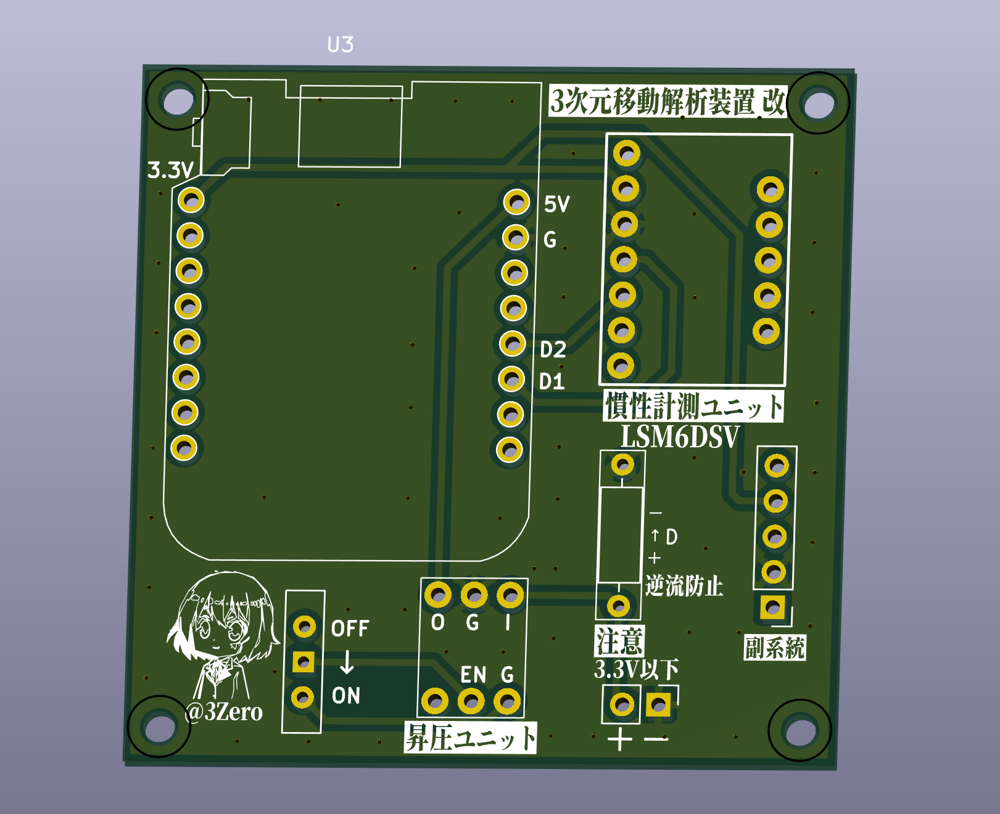
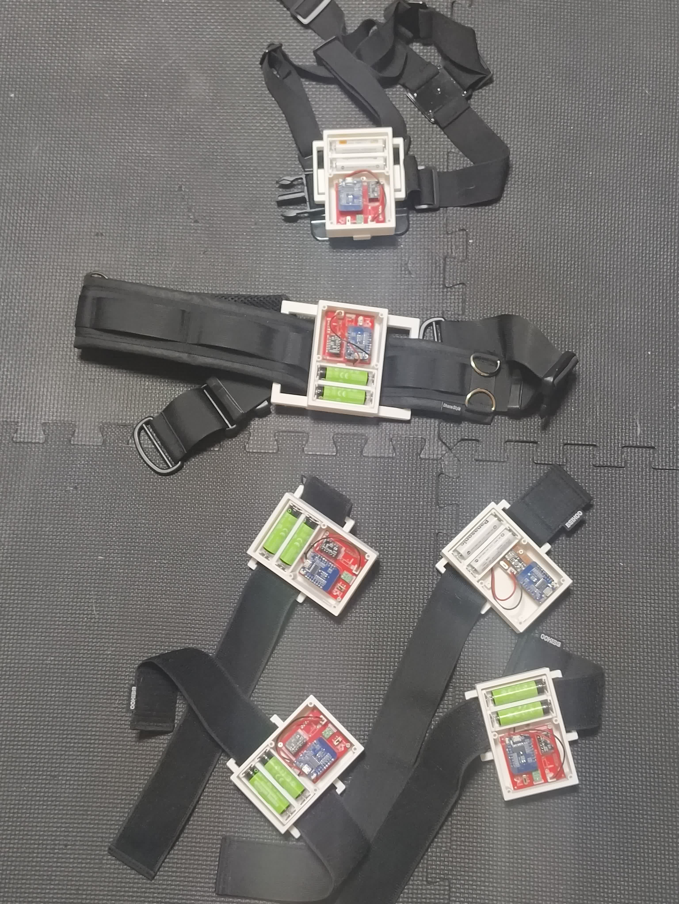
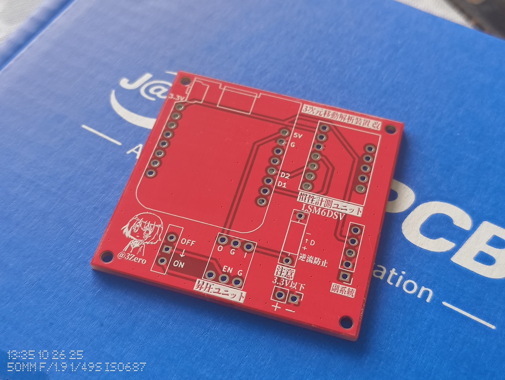
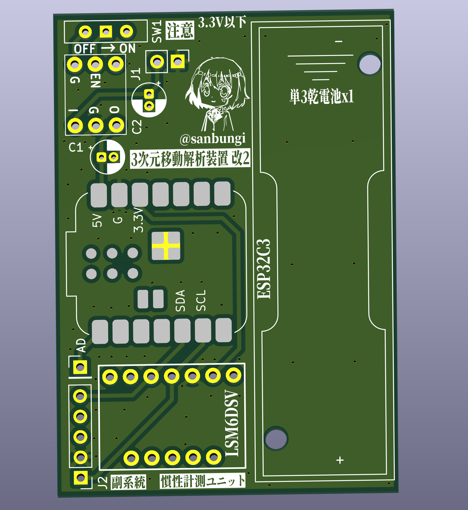
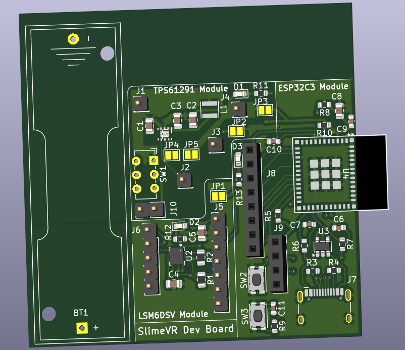

# 3次元移動解析装置 改 — 乾電池駆動 SlimeVR トラッカー

VR ヘッドセットだけでは追跡できない足や腰の動きを取るための、自作 SlimeVR 互換フルボディトラッカーです。両足先・両膝・腰・胸の6点に装着し、VRChat 上でのフルトラッキングを実現しています。

- 単3乾電池駆動 — リチウムポリマー電池のリスクを避け、安全で入手しやすい乾電池で動作
- 最上級 IMU 搭載 — SlimeVR 対応 IMU の中で最高性能の LSM6DSV を採用
- 低コスト — mocopi（5万円〜）に対し、6トラッカーを合計約2万円で制作
- 高い拡張性 — SlimeVR はトラッカー数に制限がなく、必要に応じて増設可能

  

<i>現行基板の3Dレンダリング（KiCad）</i>

https://github.com/user-attachments/assets/3b7e9f30-eae3-4ba1-b326-60af60dc9e0d

<i>VRChat 内でのフルボディトラッキング動作</i>

## 乾電池へのこだわり

SlimeVR トラッカーの自作例はほとんどがリチウムポリマー電池を電源としていますが、本プロジェクトでは **単3乾電池** を採用しています。発火・膨張のリスクがなく、どこでも手に入り、近年は充電式乾電池（eneloop 等）も安価に出回っているため、ランニングコストも実用的です。

現行版は単3電池2本で動作し、昇圧 DC-DC コンバータで MCU・IMU に必要な電圧を供給しています。

## 基板設計

回路設計と基板レイアウトは KiCad で行い、製造は JLCPCB に発注しています。

| 部品 | 型番 | 役割 |
|------|------|------|
| MCU | Xiao ESP32-C3 | Wi-Fi 通信・SlimeVR ファームウェアの実行 |
| IMU | LSM6DSV | 6軸慣性計測（加速度 + ジャイロ） |
| 昇圧 DC-DC（現行） | 秋月電子 XCL103 キット | 単3x2 の電圧を 5V に昇圧 |
| 昇圧 DC-DC（次期） | TPS61291 | 単3x1 の電圧を 3.3V に昇圧 |

## 次期バージョン（WIP）

**単3乾電池1本** で駆動する次期基板を開発中です。昇圧回路・MCU・IMU を1枚の基板に統合し、さらなる小型化と軽量化を目指しています。就職活動のため一時中断中ですが、設計データは `new_prototype/` に格納しています。

---

## Gallery

### 6点トラッカーセット

  

*実際に運用中の6点セット（両足先・両膝・腰・胸）*

### JLCPCB から届いた基板

  

*JLCPCB に発注した基板の実物。*

### 次期基板 — 単3x1 実験（WIP）

  
  

*左: 単3乾電池1本用の次期統合基板 / 右: 部品実装後のイメージ*

### 現行基板（単3x2）

  

*KiCad 上での3Dレンダリング。昇圧ユニット・IMU・逆流防止回路を搭載。*
